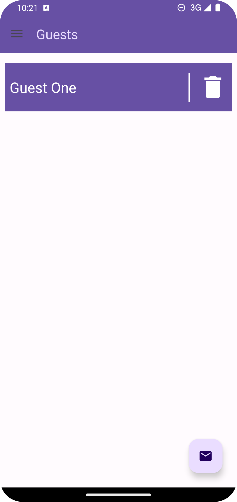
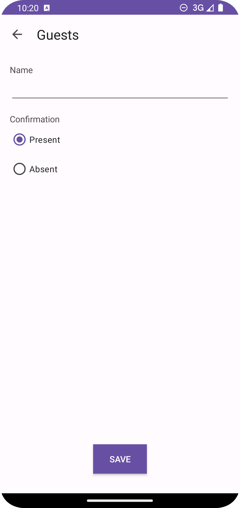
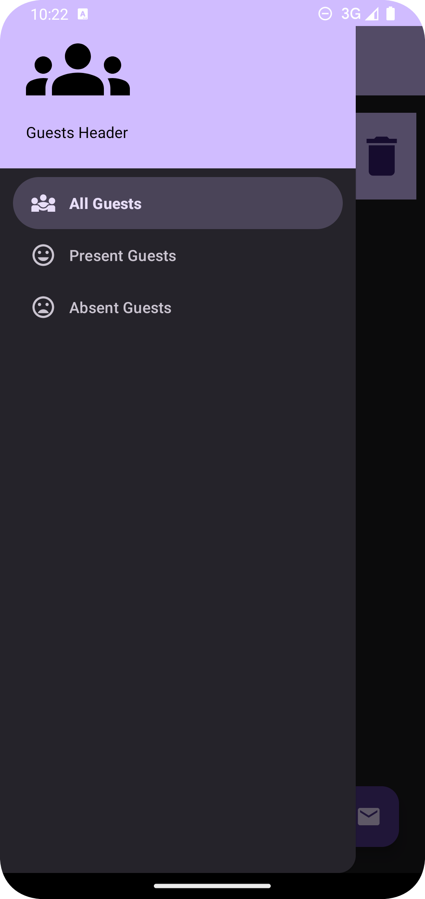

# Guests

This repository was made as my solution to the exercise proposed in the 31st section of
the [App Development Using Kotlin](https://www.udemy.com/course/curso-desenvolvedor-kotlin/)
course - *Desenvolvimento de Aplicativos Android Usando Kotlin*, in portuguese. The way I have
approached the development of this app is simple: first I've tried to code the app as close as
possible to the result intended by the teacher. Then, I'll check the section to see how the teacher
tackled the development of this app. This is the third exercise from this course that I have pushed
to GitHub.

## Table of contents

- [Overview](#overview)
    - [The challenge](#the-challenge)
    - [What I learned](#what-i-learned)
- [Design Preview](#design-preview)
    - [Light Theme](#light-theme)
    - [Dark Theme](#dark-theme)
- [Valuable-Resources](#valuable-resources)
- [Link to previous lesson from the course](#link-to-previous-lesson-from-the-course)

## Overview

### The challenge

Users should be able to:
- Enter guest name
- Enter guest category
- See form validation message if:
    - The guest name field is empty
- See all registered guests
- See guests by category
- Update guest information
- Add a guest
- Remove a guest
- See dialog to confirm removal of a guest

### What I learned

Some of the things I have learned to do while coding this app were:
- Utilize a view model to manipulate data which will be shown in fragment
- Use a SQLite database  using SQLite Helper
- Use a SQLite database using Room
- Use coroutines and flows to be able to execute database operations
- Build a Navigation Drawer from scratch
- Pass data from an adapter to an activity
- Use radio buttons, and receive their values in an activity
- Show a dialog when clicking a button

## Design Preview

### Light Theme

  

	<small><em>Navigation Drawer - Light Theme</em></small>

 

  

	<small><em>Main Content Area - Light Theme</em></small>

  

	<small><em>Register Guest Activity - Light Theme</em></small>

### Dark Theme

  

	<small><em>Navigation Drawer - Dark Theme</em></small>

 

  

	<small><em>Main Content - Dark Theme</em></small>

  

	<small><em>Register Guest Activity - Dark Theme</em></small>

## Valuable Resources

Coroutines official documentation: https://kotlinlang.org/docs/coroutines-overview.html

Save data in a local database using Room: https://developer.android.com/training/data-storage/room

The Ultimate Guide to Kotlin Flows: https://www.youtube.com/playlist?list=PLQkwcJG4YTCQHCppNAQmLsj_jW38rU9sC

## Link to previous lesson from the course

[Section 24 - Motivation](https://github.com/helderzack/section-24th_motivation)