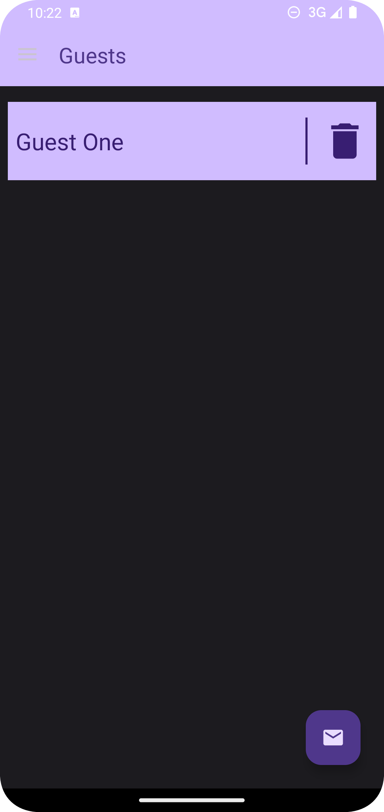
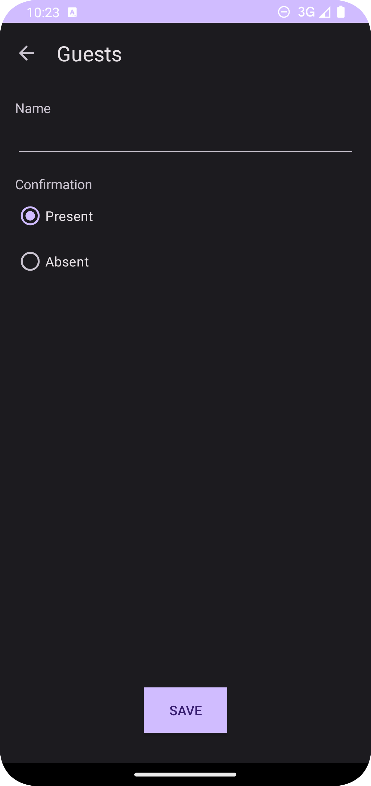

# Guests

This repository was made as my solution to the exercise proposed in the 31st section of
the [App Development Using Kotlin - Desenvolvimento de Aplicativos Android Usando Kotlin in portuguese](https://www.udemy.com/course/curso-desenvolvedor-kotlin/)
course. The way I have approached the development of this app is simple: first I've tried to code
the app as close as possible to the result intended by the teacher. Then, I'll check the section to
see how the teacher tackled the development of this app. This is the third exercise from this
course that I have pushed to GitHub.

## Design Preview

### Light Theme

  

	<small><em>Navigation Drawer - Light Theme</em></small>

 

  

	<small><em>Main Content Area - Light Theme</em></small>

  

	<small><em>Register Guest Activity - Light Theme</em></small>

### Dark Theme

  

	<small><em>Navigation Drawer - Dark Theme</em></small>

 

  

	<small><em>Main Content - Dark Theme</em></small>

  

	<small><em>Register Guest Activity - Dark Theme</em></small>

## Link to previous lesson from the course

[Section 24 - Motivation](https://github.com/helderzack/section-24th_motivation)